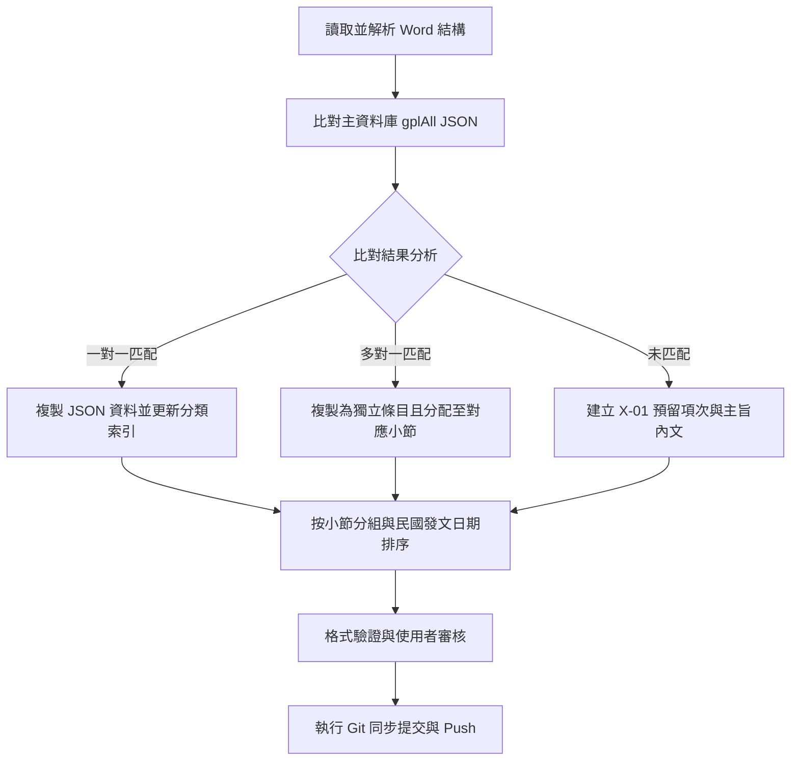

# 政府採購解釋函令 Word 轉 JSON 暨比對與分組排序規範

本技能定義了將各章節之政府採購函令 Word 文件（`.docx`）比對並匯入主資料庫（`gplAll_1150630.json`）的標準作業程序（SOP），以供後續章節直接套用。

---

## 核心工作流程 (Workflow)



---

## 詳細執行步驟與邏輯

### 1. 讀取並解析 Word 結構
- **識別小節標題與項目**：
  - 各「節」通常以特定的段落樣式（例如 `List Paragraph`）或編號模式表示。
  - 對於 112.1 新增文件，以 `X.1`、`X.2` 等數字段落劃分小節邊界，並對應至「第N節 節名」（如 `2.1` 對應 `第一節 投標須知`）。
  - 對於項目符號段落（□），應完整收集其段落內之所有文字。**注意：** 如果項目中包含軟換行符（`\n`），應以 `\n` 分割並取**最後一行非空文字**來提取發文字號。

### 2. 比對與標準化字號
- **標準化字號比對**：去除字號中的所有空格與換行符號（`\s+`），並忽略前綴的發文機關名或日期，以提高比對準確度。
- **發文字號提取正則表達式**：
  ```python
  # 優先提取括號字號，其次為標準字號，並移除日期前綴
  match = re.search(r'(\(\d+\)[^\s，、。]+字第\d+號(?:函|令)?)', last_line)
  if not match:
      match = re.search(r'([^\s，、。]+字第\d+號(?:函|令)?)', last_line)
  doc_id = match.group(1) if match else last_line
  doc_id = re.sub(r'.*?日', '', doc_id).strip()
  ```

### 3. 比對結果處理策略
- **一對一匹配**：複製主資料庫之 JSON 物件，將「分類索引」欄位更更新為目前的「章、節」，而「項」欄位設為空字串 `""`。
- **多對一匹配**（同一字號出現在不同小節）：不可去重，必須依據 Word 出現之位置，各自複製為獨立 JSON 紀錄，指派不同的「節」名稱。
- **未匹配（未收錄於主資料庫）**：
  - **建立預留項次**：為確保後續能手動補齊，需建立自定義的項次（格式為 `章-編號`，如 `2-01`、`2-02`）。
  - **自動填充欄位**：
    - 發文字號：填入提取的字號。
    - 主題：自動提取 Word 項目第一行之主旨（去除 `主旨：` 前綴）。
    - 內容：填入整個項目符號區塊的完整內文。
    - 其餘欄位（如上網日期、連結網址）設為空字串 `""`，以便使用者後續手動填寫。

### 4. 節分組與發文日期排序
- **小節順序維持**：在 JSON 中維持 Word 書寫的節順序（例如 `第一節` 至 `第七節`）。
- **民國發文日期排序邏輯**：
  - 由於民國年份長度不一（2 位數如 `880714`，3 位數如 `1120104`），**切勿直接進行字串排序**。
  - 必須編寫解析函數，提取年份、月份、日期，將其轉換為可比對的整數數值（例如 `民國年份 * 10000 + 月份 * 100 + 日期`）進行**由舊到新（升序）**排列。
  ```python
  def get_date_val(item):
      date_str = item.get("發文日期", "").strip()
      if not date_str or len(date_str) < 4:
          return 0
      try:
          year_str = date_str[:-4]
          month_str = date_str[-4:-2]
          day_str = date_str[-2:]
          return int(year_str) * 10000 + int(month_str) * 100 + int(day_str)
      except ValueError:
          return 0
  ```

### 5. 數據驗證與 Git 同步
- 每次合併或更正資料後，必須執行驗證腳本：
  1. 確認總資料筆數無誤。
  2. 確認手動修改的預留項次（如 `2-01`）未被覆寫。
  3. 確認各節內之項目完全符合日期升序。
- 依照 `AGENTS.md` 之規定，執行 `git add .`、`git commit` 以及 `git push`。

---

## 修正與防錯經驗（Lessons Learned）

> [!IMPORTANT]
> **多行換行符防錯**
> 在讀取 Word 的項目（□）時，有些段落結尾發文字號之前會有描述文字，並使用 `\n`（軟換行）。直接抓取 Paragraph 的最後幾個字可能會抓錯。必須先依據 `\n` 分割為多行，並取**最後一行的內容**作為提取發文字號的目標。

> [!WARNING]
> **民國年份排序陷阱**
> 民國字串直接排序時，`"1021231"` 會排在 `"880714"` 之前，造成時間軸錯亂。務必使用 `date[:-4]` 切片分離年份並轉為整數進行加權排序。
